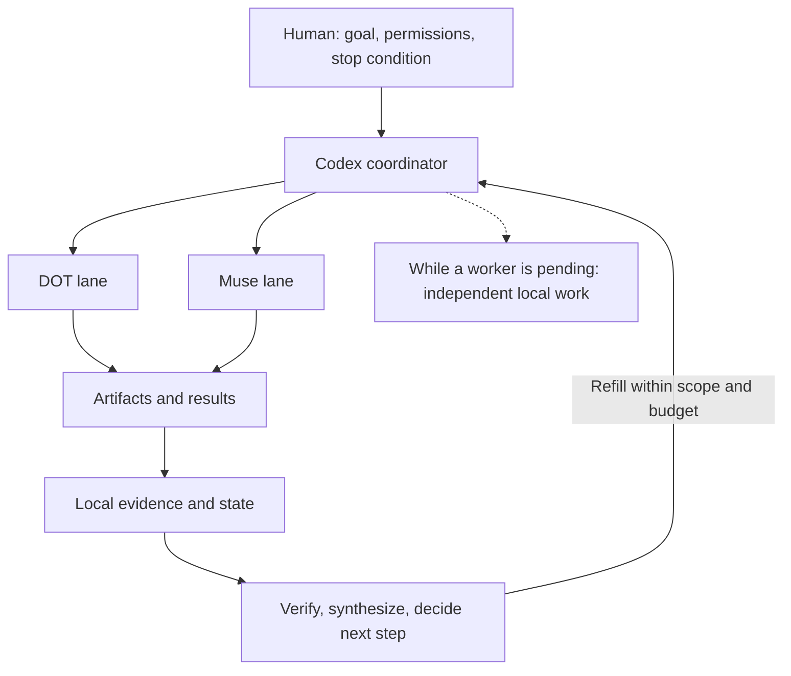

# Codex · DOT · Muse

**Failure-driven orchestration for browser AI workers.**

How do you keep multiple web AI workers moving when replies are slow, delivery is uncertain, and the coordinator wants to stop? This project develops **progress-first working rules** from recorded Codex → DOT/Muse runs: what happened, how it failed, and what to measure next.

[](#status-and-limits)
[](#what-we-actually-ran)
[](CONTRIBUTING.md)

**Recorded evidence:** a 26-hour file-evidence span · a 90-minute timed benchmark · an 8-hour research window.

[Explore in two minutes](#quick-start-explore-the-project) · [Read the failures](docs/FAILURE_MODES.md) · [Pick a first contribution](CONTRIBUTING.md#first-contributions)

Current deliverables: experiment reports, failure cases, coordinator playbooks and example contracts. A reusable agent runtime is still roadmap work.



*Conceptual workflow, not a product screenshot. Each lane progresses independently.*

## Why this problem matters

**A prompt in the composer is not a sent task.** In one run, the coordinator kept believing a worker was waiting even though the request had never been submitted. In another, the request was delivered, but repeated polling replaced useful work and a checkpoint became the reason to finish.

The interesting question is what an orchestration loop should do when its state and reality disagree. Our [failure catalog](docs/FAILURE_MODES.md) makes these mistakes inspectable.

## What we actually ran

| Run | Recorded result | What it does not prove |
|---|---|---|
| [PROJECT-WHEELS](experiments/project-wheels/ORCHESTRATOR_POSTMORTEM_20261005.md) | Formal quota 100; continued reserve discovery reached 221 unverified candidates. The file-evidence span was 26h 01m. | Uninterrupted active work or tested candidate usefulness. Reserve expansion was authorized; its cap was missing. |
| [Benchmark B](experiments/benchmark-b/04_BENCH_B_RESULT.md) | 90 minutes; Muse completed four rounds; 29 unique unverified candidates after deduplication. DOT R2 produced duplicate, hash-identical ZIPs. | A stable 2.3× speedup, measured refill latency, or a verified resource collection. |
| [FOUR_TRACK](experiments/four-track-8h/README.md) | The formal 8-hour window recorded 69 items: 61 structured + 8 raw. Post-run B06 added two; later recovery parsed the eight raw items. | 71 fully verified items, successful admission/registration, or a completed regression test. |
| [B06 / B07 audit](experiments/postrun/AUDIT_POSTRUN_50MIN.md) | B06 exposed composer-versus-message detection; B07 exposed polling and coordinator premature finish. | That a written patch has passed a long-run regression. |

These are recorded engineering observations. The [independent learning/Agent research report](research/AI_PROJECT_AND_AGENT_RESEARCH_REPORT.md) is a separate task, not another DOT/Muse run.

## Failure-driven lessons

| Failure | Working rule to test |
|---|---|
| Formal 100 → 221 without a reserve cap | Switch from discovery to verification and synthesis when coverage saturates. |
| A returned worker waits while the coordinator handles attachments | Quick triage, then refill; do deeper bookkeeping while the lane works. |
| Timeout → retry → duplicate delivery | Use bounded retries and deduplicate by run ID, entity and artifact hash. |
| B06: composer text mistaken for a submitted message | Observe submission separately from input and worker replies. |
| B07: pending worker → repeated polling → final reply | Pending worker does not mean idle coordinator; checkpoint does not mean finish. |

See the [15-case catalog](docs/FAILURE_CATALOG.csv) and the [progress-first playbook](patches/LONG_RUN_PATCH_V2.md).

## Current approach

Keep lanes independent. Prefer refill before narrative bookkeeping. During waits, parse old results, compare evidence or synthesize. Use lightweight hourly QC, finite retries and explicit stopping conditions. Apply loose retry tolerance only to low-side-effect research tasks.

**Filled ≠ sent. Read ≠ running. Delivered ≠ verified.** The [architecture](docs/ARCHITECTURE.md) and [artifact/event contracts](schemas/artifact-contract.md) explain those boundaries.

## Quick Start: explore the project

Requires Git; Python 3.9+ is optional for the read-only integrity check. No API key, browser session or worker account is needed to explore the evidence.

```sh
git clone https://github.com/nihaldipak650-collab/codex-dot-muse-orchestration-log.git
cd codex-dot-muse-orchestration-log
python tools/verify_public_hashes.py
```

The checker verifies published file bytes, not experiment correctness. Then:

1. Read the [B06/B07 audit](experiments/postrun/AUDIT_POSTRUN_50MIN.md) alongside the [playbook](patches/LONG_RUN_PATCH_V2.md).
2. Inspect the [sanitized event log](examples/sanitized-events.jsonl) and [worker state](examples/sanitized-worker-state.json).
3. Choose a [bounded contribution](CONTRIBUTING.md#first-contributions). No live worker operation is required.

To inspect the original release snapshot, check out `v0.1-freeze-2026-10-06`. That tag remains unchanged; `main` can develop the project.

## Roadmap and contributing

The next engineering priorities are reliable bootstrap, composer-versus-message detection and a progress-first coordinator loop. Event viewing, artifact contracts and a repeatable regression harness follow. These are proposed work, not shipped features.

[Roadmap with acceptance criteria](docs/ROADMAP.md) · [Contributor guide](CONTRIBUTING.md) · [Open an issue](https://github.com/nihaldipak650-collab/codex-dot-muse-orchestration-log/issues/new/choose)

Good starting work includes an English failure-case walkthrough, synthetic delivery-state fixtures, or a sanitized event-field guide. If the evidence helps your work, a star can make the project easier to find; a small reproducible contribution helps improve it.

## Documentation

| Looking for | Start here |
|---|---|
| Run history and evidence | [Timeline](docs/TIMELINE.md), [experiment results](docs/EXPERIMENTS.md), [Benchmark B](experiments/benchmark-b/05_A_VS_B.md) |
| Failure analysis and operating rules | [Failure modes](docs/FAILURE_MODES.md), [lessons](docs/LESSONS_LEARNED.md), [V2 playbook](patches/LONG_RUN_PATCH_V2.md) |
| Frozen state and continuation boundaries | [State at the freeze cutoff](docs/CURRENT_STATE.md), [handoff](docs/NEXT_STEPS.md), [historical landing page](docs/FREEZE_README.md) |
| Presentation research | [Design plan](GITHUB_PRESENTATION_PLAN.md), [16 wheels](WHEELS_RESEARCH.md), [12-repository comparison](BENCHMARK_REPOS.csv) |
| Safety and source provenance | [Security policy](SECURITY.md), [redaction report](docs/SECURITY_REDACTION_REPORT.md), [archive index](docs/ARCHIVE_INDEX.csv) |

Most historical evidence documents are in Chinese. English explanations and source-linked translations are welcome.

## Status and limits

This is a research project with usable documentation and a hash-check utility. It has no turnkey orchestration runtime or live demo. The freeze's regression start was invalidated; its B07 record contains reply metadata but zero delivered candidate items. Read the [cutoff state](docs/CURRENT_STATE.md) before interpreting status fields.

Evidence uses **CONFIRMED / REPORTED / INFERENCE / UNKNOWN**. Candidate discovery and parse success do not imply verification. Some originals are local-only because of credentials, privacy or redistribution boundaries; archive hashes identify them, but this public repository cannot replay every historical run.

This community project is not affiliated with or endorsed by the providers of Codex, DOT or Muse. No project license has been selected; do not assume an MIT/Apache reuse grant. [License selection](docs/ROADMAP.md#owner-decisions) is an owner decision.

中文：这是以真实长跑失败为起点的浏览器 AI 协调研究项目。先读失败案例与调度原则，再从小型文档、示例数据或事件说明贡献开始；当前没有一键运行的 Agent 产品。
