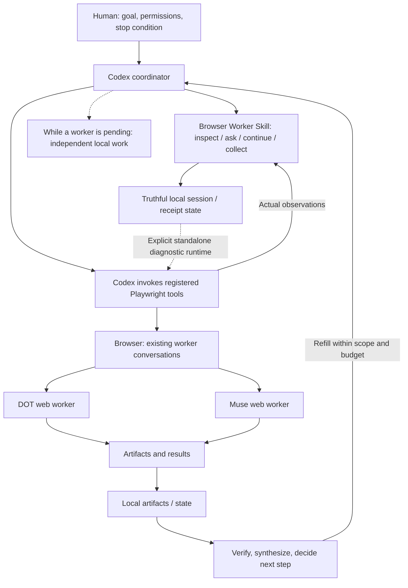

# Browser Worker Skill · Codex / DOT / Muse

<!-- PHASE_CLOSEOUT_20261006 -->
> **Phase frozen - 2026-10-06:** Start with [START_HERE](docs/phase-closeout-20261006/START_HERE.md). Browser Worker 3.0.0 implementation stays at `f8dcb4bb3c348fd0f95d5af2a594fc3626635b0a`; V3 provider-live full workflow is **NOT_RUN**. Feature development and live trials are paused. Only an explicit user restart authorizes the next short, bounded user journey.

| What a newcomer should know | Current evidence / boundary |
|---|---|
| WHAT IS REAL | Earlier registered Playwright workflows ran DOT + Muse, multiple turns, ZIP delivery and local reading. Both workers delivered ZIPs; CSV/MD/inline also occurred. Benchmark B retains four original ZIPs and hash evidence. |
| WHAT IS IMPLEMENTED | Browser Worker 3.0.0 has local implementation and recorded passing tests: 42 Python, 10 PowerShell checks. |
| WHAT IS NOT PROVEN | V3 provider-live full workflow, historical ZIP compatibility and reduced user effort are not established. |
| WHAT IS CURRENT | This phase is closed; no automatic feature work, ACK smoke or one-hour trial. |
| WHAT IS NEXT | After explicit user restart: task → DOT/Muse → reply → artifact or inline → actual local read → Codex interpretation → same-thread revision → final delivery. |

[Phase report](docs/phase-closeout-20261006/REPORT.md) · [state and gaps](docs/phase-closeout-20261006/STATE_AND_GAPS.md) · [historical ZIP hashes/formats](docs/phase-closeout-20261006/SOURCES.md#历史zip字节原包不随本次文档上传)


**Short runs. Persistent workers. Long-running goals.**

A Codex skill for calling existing web AI conversations repeatedly while retaining truthful delivery/session state. Codex plans, performs registered browser actions and verifies; the Skill prepares turns and reconciles receipts. The V3 provider-live loop remains unverified; earlier Playwright workflows did run successfully.

**Browser Worker 3.0.0:** [full workflow](skills/browser-worker/references/full-workflow.md) restores registered Playwright operation, correlated artifact discovery, ZIP/local read, SHA-256 and whole-row dedupe, Muse inline fallback, partial-result preservation and stale-state reconciliation. [Design and full live regression](docs/BROWSER_WORKER_V3_DESIGN.md) · [current test/live evidence](docs/BROWSER_WORKER_V3_EVIDENCE.md). Local passes do not establish provider-live compatibility.

Codex uses **Playwright / Playwright MCP to operate existing DOT and Muse conversations in a real browser**: send prompts, observe replies, save local results, then decide the next task. This project studies how to keep those workers moving when replies are slow, delivery is uncertain, and the coordinator wants to stop.

[](#status-and-limits)
[](#what-we-actually-ran)
[](CONTRIBUTING.md)

**Recorded evidence:** a 26-hour file-evidence span · a 90-minute timed benchmark · an 8-hour research window.

[Explore in two minutes](#quick-start-explore-the-project) · [Read the failures](docs/FAILURE_MODES.md) · [Pick a first contribution](CONTRIBUTING.md#first-contributions)

Current deliverables include a [Browser Worker Skill](skills/browser-worker/SKILL.md), local alias/session persistence, artifact handling, a standalone diagnostic runtime and failure evidence. Read the current handoff before operational guides. The [earlier gap audit](PROJECT_GAP_AUDIT.md) records the pre-runtime baseline, not the current task list.

## How it works



*Diagram of the recorded operating pattern. The experimental runtime implements one worker communication loop, not the multi-lane scheduling shown here. The historical record does not pin an extension topology.*

1. Human sets the goal, permissions and stop condition; Codex selects the next task.
2. Browser control locates a worker tab, fills the normal conversation composer and submits the prompt. Filling alone does not prove submission.
3. Codex observes the conversation's submitted message and worker reply through browser tools, then captures text/artifacts locally.
4. Codex triages results, updates state/ledgers and decides whether to refill an available lane, work locally or stop. The progress-first playbook improves this process; it is not an implemented scheduler here.

| Responsibility | What performs it |
|---|---|
| Browser control | Playwright/MCP tools interact with tabs and page elements. |
| Coordinator logic | Codex chooses tasks, interprets delivery/results and decides next steps. |
| Worker intelligence | Existing DOT/Muse web AI applications produce replies. |
| Local state/artifacts | Saved results, event records and ledgers support comparison and recovery. |

The [architecture record](docs/ARCHITECTURE.md) and [B06/B07 tool-action audit](experiments/postrun/AUDIT_POSTRUN_50MIN.md) support this chain. This project does not reimplement the worker applications or a foundation model; the documented path is browser interaction, not a provider-internal API proxy. DOT is the recorded lane name; a DOT-to-ChatGPT identity mapping is not established by these public records.

### Why existing web conversations?

The original resource-research work used existing independent DOT/Muse conversations as worker lanes. That makes browser-visible delivery, waiting, extraction and refill behavior the subject of these experiments. The records do not establish that browser control is cheaper, better or preferable to official APIs. This is a study of that existing workflow, not an API-versus-browser verdict.

## Why this problem matters

**A prompt in the composer is not a sent task.** In one run, the coordinator kept believing a worker was waiting even though the request had never been submitted. In another, the request was delivered, but repeated polling replaced useful work and a checkpoint became the reason to finish.

The interesting question is what an orchestration loop should do when its state and reality disagree. Our [failure catalog](docs/FAILURE_MODES.md) makes these mistakes inspectable.

## What we actually ran

| Run | Recorded result | What it does not prove |
|---|---|---|
| [PROJECT-WHEELS](experiments/project-wheels/ORCHESTRATOR_POSTMORTEM_20261005.md) | Formal quota 100; continued reserve discovery reached 221 unverified candidates. The file-evidence span was 26h 01m. | Uninterrupted active work or tested candidate usefulness. Reserve expansion was authorized; its cap was missing. |
| [Benchmark B](experiments/benchmark-b/04_BENCH_B_RESULT.md) | 90 minutes; Muse completed four rounds; 29 unique unverified candidates after deduplication. DOT R2 produced duplicate, hash-identical ZIPs. | A stable 2.3× speedup, measured refill latency, or a verified resource collection. |
| [FOUR_TRACK](experiments/four-track-8h/README.md) | The formal 8-hour window recorded 69 items: 61 structured + 8 raw. Post-run B06 added two; later recovery parsed the eight raw items. | 71 fully verified items, successful admission/registration, or a completed regression test. |
| [B06 / B07 audit](experiments/postrun/AUDIT_POSTRUN_50MIN.md) | B06 exposed composer-versus-message detection; B07 exposed polling and coordinator premature finish. | That a written patch has passed a long-run regression. |

These are recorded engineering observations. The [independent learning/Agent research report](research/AI_PROJECT_AND_AGENT_RESEARCH_REPORT.md) is a separate task, not another DOT/Muse run.

## Failure-driven lessons

| Failure | Working rule to test |
|---|---|
| Formal 100 → 221 without a reserve cap | Switch from discovery to verification and synthesis when coverage saturates. |
| A returned worker waits while the coordinator handles attachments | Quick triage, then refill; do deeper bookkeeping while the lane works. |
| Timeout → retry → duplicate delivery | Use bounded retries and deduplicate by run ID, entity and artifact hash. |
| B06: composer text mistaken for a submitted message | Observe submission separately from input and worker replies. |
| B07: pending worker → repeated polling → final reply | Pending worker does not mean idle coordinator; checkpoint does not mean finish. |

See the [15-case catalog](docs/FAILURE_CATALOG.csv) and the [progress-first playbook](patches/LONG_RUN_PATCH_V2.md).

## Current approach

Keep lanes independent. Prefer refill before narrative bookkeeping. During waits, parse old results, compare evidence or synthesize. Use lightweight hourly QC, finite retries and explicit stopping conditions. Apply loose retry tolerance only to low-side-effect research tasks.

**Filled ≠ sent. Read ≠ running. Delivered ≠ verified.** The [architecture](docs/ARCHITECTURE.md) and [artifact/event contracts](schemas/artifact-contract.md) explain those boundaries.

## Related projects: different layers

Based on the [previous README comparison](BENCHMARK_REPOS.csv) and its [source receipts](docs/PRESENTATION_SOURCE_RECEIPTS.json), not new runtime testing:

| Project | Documented focus | Our current focus |
|---|---|---|
| [browse_code](https://github.com/Dedeep007/browse_code) | Browser-chat to local coding bridge using a Python server and extension. | Long-running coordination of existing worker conversations; no equivalent coding bridge shipped. |
| [chatgpt-browser-agent](https://github.com/abdallhMoukdad/chatgpt-browser-agent) | Browser daemon with CLI/MCP interfaces and an agentic loop for ChatGPT. | Recorded multi-lane delivery, waiting, recovery and refill failures. |
| [browser-agent](https://github.com/ianmadez/browser-agent) | OpenBrowser-branded CLI/extension bridge for browser-chat coding. | Evidence and playbooks; no extension component established here. |
| [Playwright MCP](https://github.com/microsoft/playwright-mcp) | Browser-control tools exposed through MCP. | Coordinator behavior above a browser-control layer. |
| [browser-use](https://github.com/browser-use/browser-use) | Agents that perform browser tasks. | Coordination of existing web AI workers, rather than a general browser-task agent implementation. |

These describe different responsibilities, not a performance ranking. Their listed capabilities are README descriptions, not independently verified runtime results.

## Browser Worker Skill

**Choose the execution path first.** V3 prefers [registered Playwright operation](skills/browser-worker/references/full-workflow.md). In that path the wrapper prepares a turn; Codex performs browser actions with its registered tools and supplies fresh observations for collection. It is not an automatically registered atomic MCP tool.

Registered operation requires Python plus Codex's already-registered browser tools. The wrapper does not automatically invoke them. After explicit restart and fresh validated observations, the registered reservation/collection commands have this shape (reference only; they do not authorize a run):

Call a local alias rather than exposing private thread URLs to the coordinator interface:

```sh
python skills/browser-worker/scripts/worker.py ask --transport registered --worker dot --observation sessions.local/observation.json --message "<authorized task>"
# PREPARED: Codex sends the returned text once using registered Playwright tools.
# Codex then saves a fresh actual page observation before collection.
python skills/browser-worker/scripts/worker.py collect --transport registered --worker dot --observation sessions.local/observation.json
```

Configure ignored `workers.local.json` from [the placeholder example](workers.example.json). [SKILL.md](skills/browser-worker/SKILL.md) describes setup, state and recovery. The wrapper reuses the runtime, binds continuation to the same thread hash and defaults to six sending attempts. Pending/unknown delivery blocks new sends; collect only observes the original turn. Codex supplies actual feedback and decides whether CONTINUE, NEED_CONTEXT, BLOCKED or DONE is appropriate; natural replies remain supported. There is no automatic coordinator, wake service or worker-requested command execution.

Omitting --transport still selects standalone in the unchanged implementation. Use explicit `--transport standalone` only for diagnostics, local tests or intentionally selected standalone usage; PowerShell 7 is required. [ACK/one-hour trial](ONE_HOUR_SINGLE_WORKER_TRIAL.md) is a historical diagnostic design, superseded as the next validation target. It is not an automatic startup sequence. See [reference mechanisms](docs/BROWSER_WORKER_REFERENCES.md); no external repositories are vendored.

Either worker may deliver structured inline results or one primary artifact/bundle, according to actual provider capability and page state. Inline is a reliable fallback for both, not Muse's permanent-only mode. Historical DOT and Muse ZIPs use formats different from the strict V3 contract; local V3 tests do not prove those old packages compatible.

## Minimal Runtime

**Standalone diagnostic transport; provider-live loop unverified.** Code connects to an existing Playwright MCP endpoint, selects/opens an exact worker tab, establishes baseline, fills and submits one RUN_ID prompt, checks a new user-message receipt, observes a correlated reply and saves JSON. Recorded fake-MCP tests exercise the CLI/transport. Earlier control preflights did not confirm browser control; no new live test or ACK is claimed by this closeout.

See [diagnostic setup and commands](runtime/README.md), [result schema](schemas/runtime-result.schema.json) and [synthetic tests](tests/test_runtime.py). PowerShell 7 is required; worker URLs/selectors stay local. Completion accepts matching structured run_id/state, exact ACK, or a verified UI completion signal with stable no-generation observations. ACK is only a diagnostic asset. The standalone script has no automatic resend, multi-worker scheduler or attachment capture. V3 artifact handling is a separate shared layer; its provider-live acquisition remains unverified.

```sh
pwsh -NoProfile -File tests/test_states.ps1
python tests/test_runtime.py
```

These local tests require no worker account. Runtime commands are diagnostic references, not a recommended live startup sequence; no live action starts without explicit user restart. The exploration commands below only inspect published evidence.

## Quick Start: explore the project

Requires Git; Python 3.9+ is optional for the read-only integrity check. No API key, browser session or worker account is needed to explore the evidence.

```sh
git clone https://github.com/nihaldipak650-collab/codex-dot-muse-orchestration-log.git
cd codex-dot-muse-orchestration-log
python tools/verify_public_hashes.py
```

The checker verifies published file bytes, not experiment correctness. **These commands do not connect to Playwright or send a worker prompt.** Then:

1. Read the [B06/B07 audit](experiments/postrun/AUDIT_POSTRUN_50MIN.md) alongside the [playbook](patches/LONG_RUN_PATCH_V2.md).
2. Inspect the [sanitized event log](examples/sanitized-events.jsonl) and [worker state](examples/sanitized-worker-state.json).
3. Choose a [bounded contribution](CONTRIBUTING.md#first-contributions). No live worker operation is required.

To inspect the original release snapshot, check out `v0.1-freeze-2026-10-06`. That tag and v0.2 remain unchanged. Current main is this phase's frozen documentation/implementation handoff; no new release/tag is created.

## Roadmap and contributing

Development is paused. Only an explicit user restart opens a short, bounded full-workflow user journey using registered Playwright and both workers in scope. Measure human interventions, manual clicks, copy/paste, rescue events, actual artifact receipt/read and context continuity; compare user effort with old manual Playwright coordination. Completion and usable delivery matter, not running for an hour. The [original V0 spec](MINIMAL_RUNTIME_V0_SPEC.md) and old smoke plans remain historical assets.

[Roadmap with acceptance criteria](docs/ROADMAP.md) · [Contributor guide](CONTRIBUTING.md) · [Open an issue](https://github.com/nihaldipak650-collab/codex-dot-muse-orchestration-log/issues/new/choose)

Good starting work includes an English failure-case walkthrough, synthetic delivery-state fixtures, or a sanitized event-field guide. If the evidence helps your work, a star can make the project easier to find; a small reproducible contribution helps improve it.

## Documentation

| Looking for | Start here |
|---|---|
| Run history and evidence | [Timeline](docs/TIMELINE.md), [experiment results](docs/EXPERIMENTS.md), [Benchmark B](experiments/benchmark-b/05_A_VS_B.md) |
| Failure analysis and operating rules | [Failure modes](docs/FAILURE_MODES.md), [lessons](docs/LESSONS_LEARNED.md), [V2 playbook](patches/LONG_RUN_PATCH_V2.md) |
| Current phase and restart boundary | [START_HERE](docs/phase-closeout-20261006/START_HERE.md), [current gaps](docs/phase-closeout-20261006/STATE_AND_GAPS.md) |
| Historical freeze state | [14:02 cutoff](docs/CURRENT_STATE.md), [historical handoff](docs/NEXT_STEPS.md), [historical landing page](docs/FREEZE_README.md) |
| Presentation research | [Design plan](GITHUB_PRESENTATION_PLAN.md), [16 wheels](WHEELS_RESEARCH.md), [12-repository comparison](BENCHMARK_REPOS.csv) |
| Actual mechanism and runnable gaps | [Gap audit](PROJECT_GAP_AUDIT.md), [single-worker V0 specification](MINIMAL_RUNTIME_V0_SPEC.md) |
| Safety and source provenance | [Security policy](SECURITY.md), [redaction report](docs/SECURITY_REDACTION_REPORT.md), [archive index](docs/ARCHIVE_INDEX.csv) |

Most historical evidence documents are in Chinese. English explanations and source-linked translations are welcome.

## Status and limits

This is a research prototype with Browser Worker 3.0.0, local tests, documentation and a hash-check utility. V3 provider-live full workflow remains unverified. The 14:02 freeze recorded an invalidated regression and zero delivered B07 items; the later [three-hour old-workflow regression](experiments/regression/20261006_3H_COORDINATOR_SUMMARY.md) recovered B07 and brought the ledger to 74. Neither old record is V3 live acceptance. Read START_HERE for current state.

Evidence uses **CONFIRMED / REPORTED / INFERENCE / UNKNOWN**. Candidate discovery and parse success do not imply verification. Some originals are local-only because of credentials, privacy or redistribution boundaries; archive hashes identify them, but this public repository cannot replay every historical run.

This community project is not affiliated with or endorsed by the providers of Codex, DOT or Muse. No project license has been selected; do not assume an MIT/Apache reuse grant. [License selection](docs/ROADMAP.md#owner-decisions) is an owner decision.

中文：旧 Playwright 流程真实跑过 DOT/Muse、多轮、ZIP 和本地读取；V3 已有本地实现与测试，但 provider-live 全流程未通过。本阶段冻结，只有用户明确重启才验证一次短、有界的真实用户旅程。
