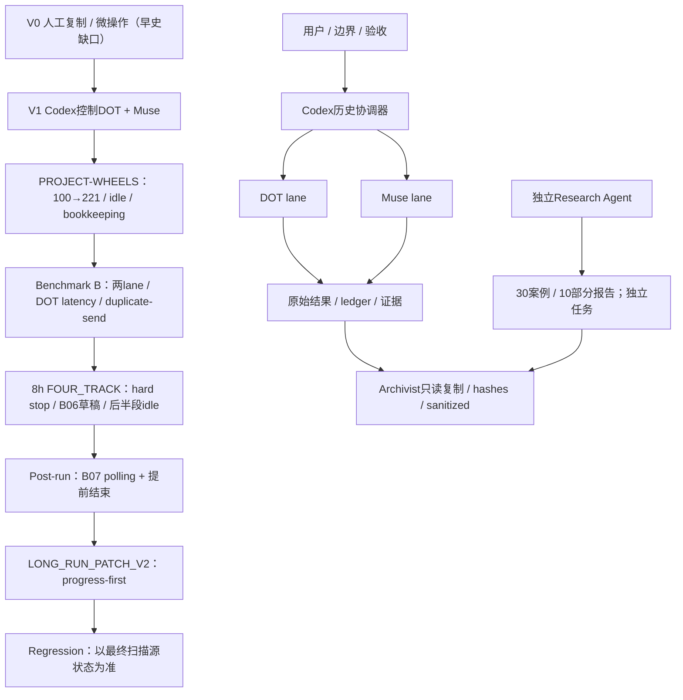

# 架构与版本演化

证据分级：CONFIRMED=本次核对本地原始记录/工件；REPORTED=既有Agent或worker报告，未独立复核；INFERENCE=基于证据的解释；UNKNOWN=现有证据不能确定。文件存在、Agent声称完成、结构检查通过均不等于内容正确或运行验收通过。

历史协调器：用户定义边界→Codex总控→两条独立DOT/Muse lane→RUN_ID回复→工件→canonical去重→ledger/状态→下一步。DOT偏A/B或GitHub；Muse偏C/D或X/YouTube，具体以prompt为准。
Control plane（Playwright/MCP/标签页）与worker应用服务分开：可控但服务错误为APP_DOWN；控制调用不可用是CONTROL_DOWN/工具不可用；一次tab缺失不证明具体根因。会话ID只是连接材料，不是worker身份、完成或授权凭据。
Data plane：prompt/RUN_ID→独立用户消息（提交）→独立worker回复（结果）→保存原件→解析→核对→入账。composer包含文字≠发送，已读≠正在计算，状态字符串≠事实。

V2原则：independent lanes；refill-first；finite retry；waiting-time local work；hourly lightweight QC；checkpoint≠finish；saturation→synthesis。公开检索中有限重复容忍不适用于付款、报名、发布、删除等副作用。
源：ORCHESTRATOR_CONTEXT、Benchmark协议、LONG_RUN_PATCH_V2；架构图为INFERENCE/文档约定，不声明有已实现的新控制框架。
